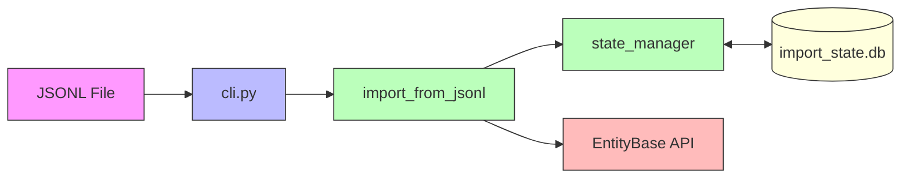

# entitybase-import

A command-line tool for importing entities into the EntityBase API from JSONL files.

## Architecture



## Features

- **Unified CLI**: Single entry point for import and state management
- **Parallel Processing**: Configurable concurrency for faster imports
- **Resume Capability**: SQLite-based state management to track progress and resume interrupted imports
- **Retry Logic**: Automatic retry with exponential backoff for failed imports
- **Detailed Logging**: Comprehensive logging to both console and files
- **Status Tracking**: Real-time progress tracking with rate and ETA calculations
- **Cleanup Options**: Automatic or manual database cleanup after import

## Installation

```bash
# Clone the repository
git clone <repository-url>
cd entitybase-import

# Setup virtual environment and install dependencies
make setup
```

## Quick Start

```bash
# Show help
python -m src.cli help

# Download Wikidata entities
python -m src.cli download -o data.jsonl Q42 P31
python -m src.cli download -o data.jsonl --random-items 100

# Import entities
python -m src.cli import data/entities.jsonl

# With custom concurrency and API URL
python -m src.cli import data/entities.jsonl -c 20 --host api.example.com

# Import specific line range
python -m src.cli import data/entities.jsonl --from 1000 --to 2000
```

## CLI Commands

| Command | Description |
|---------|-------------|
| `import` | Import entities from JSONL file |
| `download` | Download Wikidata entities to JSONL |
| `status` | Show current import status |
| `list` | List entities (with filters) |
| `stats` | Show overall statistics |
| `runs` | List all import runs |
| `export` | Export entities to CSV |
| `reset` | Reset import state |
| `help` | Show this help message |

### Examples

```bash
# Download entities from Wikidata
python -m src.cli download -o data.jsonl Q42
python -m src.cli download -o data.jsonl --random-items 50 --random-properties 5

# Check import status
python -m src.cli status

# Show statistics
python -m src.cli stats

# List failed entities
python -m src.cli list --status failed

# List all runs
python -m src.cli runs

# Export failed to CSV
python -m src.cli export --status failed --file failed.csv

# Reset specific run
python -m src.cli reset --run-id 1

# Reset all state (will prompt for confirmation)
python -m src.cli reset
```

## Import Options

| Option | Default | Description |
|--------|---------|-------------|
| `jsonl_file` | Required | Path to JSONL file to import |
| `--concurrency, -c` | 10 | Number of parallel imports |
| `--progress-interval, -p` | 10 | Show progress every N batches |
| `--api-url` | `http://localhost:8000/v1/entitybase` | API base URL |
| `--db-path` | `import_state.db` | Path to SQLite state database |
| `--cleanup` | False | Prompt to delete database after import |
| `--auto-cleanup` | False | Automatically delete database (no prompt) |
| `--log-level` | `INFO` | Logging level (DEBUG, INFO, WARNING, ERROR) |
| `--from` | None | Start from line number (1-indexed) |
| `--to` | None | Stop at line number (1-indexed) |

## Import Examples

```bash
# Basic import (uses default API URL http://localhost:8000/v1/entitybase)
python -m src.cli import data.jsonl

# Import with higher concurrency for faster processing
python -m src.cli import data.jsonl -c 20

# Import to a specific API server
python -m src.cli import data.jsonl --api-url http://api.example.com/v1/entitybase

# Resume an interrupted import (automatically picks up where left off)
python -m src.cli import data.jsonl

# Import a specific range of lines
python -m src.cli import data.jsonl --from 1000 --to 2000

# Import with debug logging
python -m src.cli import data.jsonl --log-level DEBUG

# Import and auto-cleanup database after completion
python -m src.cli import data.jsonl --auto-cleanup

# Import using custom database file
python -m src.cli import data.jsonl --db-path my_import_state.db
```

### Import a large dataset with progress tracking

```bash
# Import 100k+ entities with high concurrency
python -m src.cli import large_data.jsonl -c 50 -p 100

# Check progress while running (in another terminal)
python -m src.cli status
```

## Download Command

Download Wikidata entities and save as JSONL for import:

```bash
# Download specific entities
python -m src.cli download -o data.jsonl Q42 P31 L42

# Download random entities (ID ranges: items Q1-Q100M, properties P1-P10k, lexemes L1-L100k)
python -m src.cli download -o data.jsonl --random-items 100
python -m src.cli download -o data.jsonl --random-items 50 --random-properties 10 --random-lexemes 20

# With seed for reproducibility
python -m src.cli download -o data.jsonl --random-items 100 --seed 42

# Append to existing file
python -m src.cli download -o data.jsonl Q123 --append
```

### Download Options

| Option | Default | Description |
|--------|---------|-------------|
| `entity_ids` | Optional | Specific Wikidata IDs (Q42, P31, L42) |
| `--random-items, -i` | 0 | Download N random items (Q1-Q100,000,000) |
| `--random-properties, -p` | 0 | Download N random properties (P1-P10,000) |
| `--random-lexemes, -l` | 0 | Download N random lexemes (L1-L100,000) |
| `--output, -o` | Required | Output JSONL file path |
| `--append, -a` | False | Append to existing file |
| `--seed, -s` | None | Random seed for reproducibility |
| `--verbose, -v` | False | Print verbose output |

## JSONL Format

Each line should contain a complete JSON entity object:

```json
{"type":"item","id":"Q1","labels":{"en":{"language":"en","value":"Example"}}}
{"type":"item","id":"Q2","labels":{"en":{"language":"en","value":"Another"}}}
```

## State Management

The import tool uses SQLite to track import state:

- **Pending**: Entities waiting to be imported
- **Processing**: Currently being imported
- **Success**: Successfully imported
- **Skipped**: Already exists in the database (409 Conflict)
- **Failed**: Import failed with error details

## Development

```bash
# Setup development environment
make setup                    # Create venv and install with dev dependencies
make clean                    # Remove venv and cache files

# Development commands
make install                  # Install package
make lint                     # Run ruff linter
make test                     # Run tests (includes lint first)
make typecheck                # Run mypy type checker
```

## API Integration

The import tool connects to the EntityBase API via the `/import` endpoint:

- **Method**: POST
- **Headers**:
  - `X-User-ID`: "0"
  - `X-Edit-Summary`: "Bulk import"
- **Body**: JSON entity data

## License

This program is licensed under GNU General Public License v3.0 or later. See the [LICENSE](LICENSE) file for details.

## Contributing

[Add contribution guidelines here]
